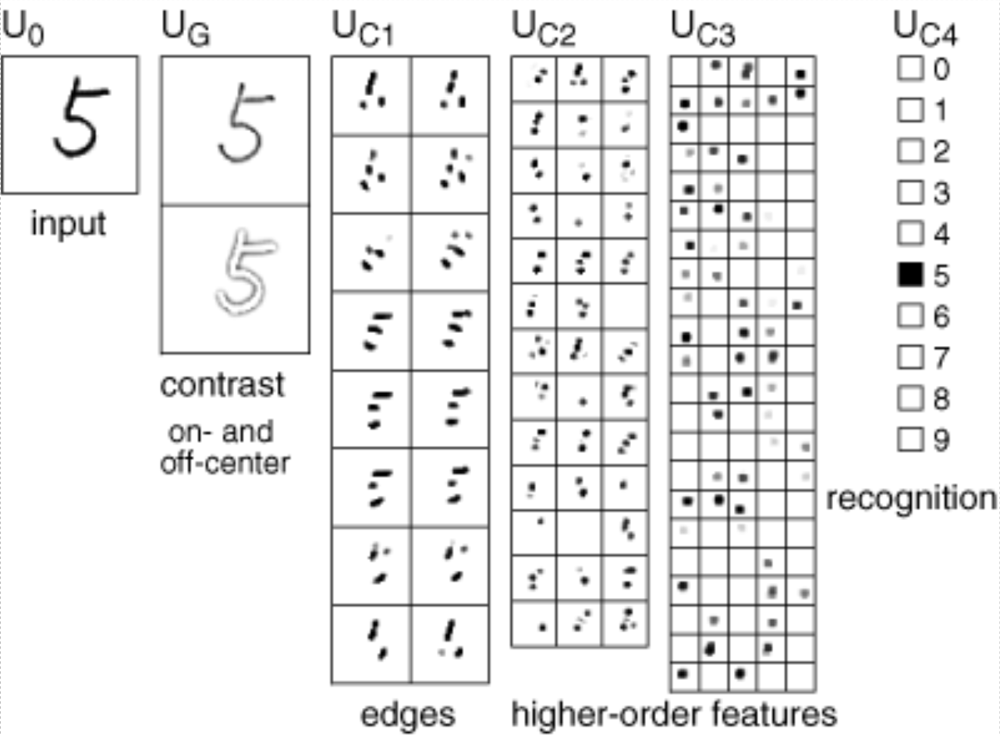

# neocognitron
Testing the neocognitron (1979) on MNIST digits (1998).



Using the neocognitron implementation from: https://github.com/altugkarakurt/NeuralHDR


## Usage
It fowards 10 images (0-9) of each MNIST digit, and then finally predicts the number 5 image.
```
python test.py
```

## Requirements
* numpy
* tensorflow
* matplotlib
* opencv-python